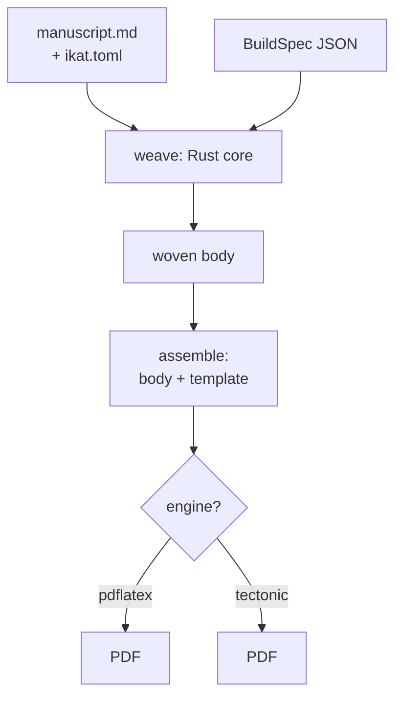
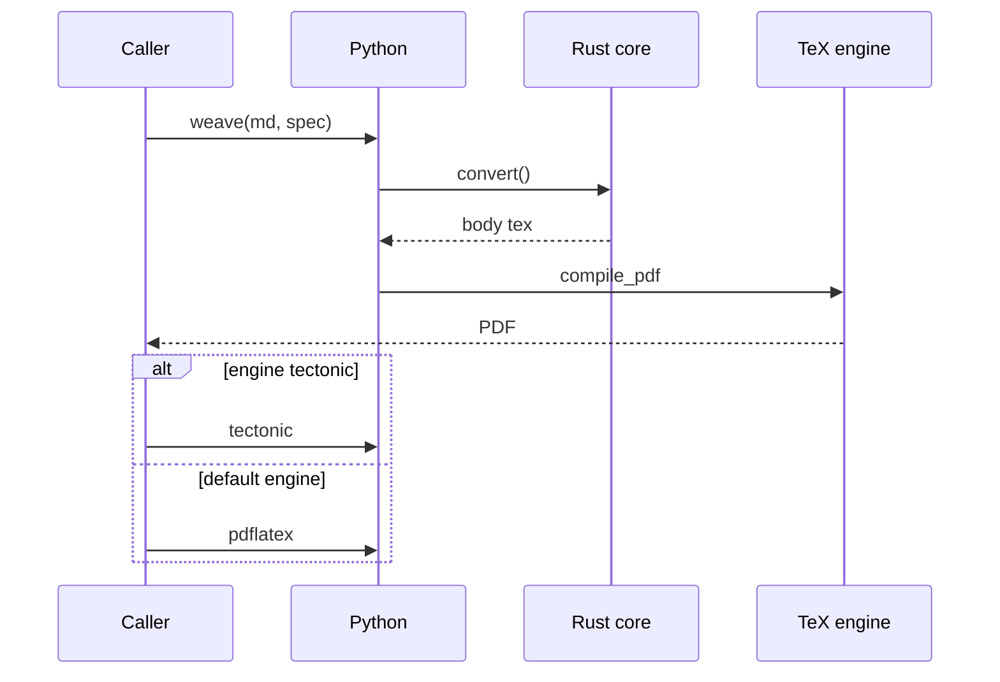
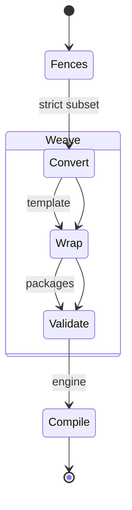

# ikat: weaving Markdown into LaTeX

## Abstract

Manuscripts live in Markdown — camera-ready papers live in LaTeX.
ikat closes that gap with a strict-subset Markdown pipeline: a Rust
core owns parsing, layout math, and code generation while thin Python
wrappers carry strings across the boundary. Float placement, publisher
templates, and engine choice are configuration, not post-processing.
This paper is its own demo: every heading, float, table, citation,
and plot below was woven by ikat itself. (118 Rust tests, 76 Python
tests, and compile proofs guard the behavior; acceptance is one
document rebuilt to the byte.)

## 1. Introduction

The journey from draft to submission is a format translation with
opinions. Authors think in sections, figures, and `code`; publishers
think in floats, baselines, and bibliographies. Between them sits a
manual step of paste, reformat, and renumber that is tedious,
brittle, and repeated for every revision. Tools that automate it
tend to fail in one of two directions: they accept all of Markdown
and produce fragile LaTeX, or they emit beautiful LaTeX from a
language nobody writes. ikat takes the third path: a strict subset
of Markdown with
**fail-fast** errors, deterministic output, and a golden master test
that keeps the published paper byte-identical across refactors.

The architecture follows one rule: Rust owns compute, Python carries
strings. Parsing, float resolution, TikZ emission, and pgfplots
generation live in the `ikat` crate; the `ikat` package exposes
`build_document`, a template library, a CLI, and an MCP server over a
single `BuildSpec` JSON boundary. Nothing crosses that boundary
except data (no callbacks, no shared state, no surprises). The whole
pipeline is $O(n)$ in document size: events in, LaTeX out, with no
tree that could blow up on a long manuscript.

Three doctrines shape every decision. First, the subset is strict:
unknown attributes, dangling citation keys, and doubled skeleton
tokens are build errors. LaTeX logs are never the debugger.
Second, defaults never move: tuning emits preamble lines only when
they differ from the LaTeX defaults, so untouched documents weave
byte-identically. Third, the paper is the test suite, and §4 names
the numbers. Sections that follow use mechanisms §2–§5
describe; §6 collects the skeleton token contract.

The paper you are reading is the demo and the test at once. Its
four diagrams, four tables, and two plots were woven from the
Markdown source beside this PDF: no hand-placed floats, no
touched-up `.tex`. Two of the diagrams sit anchored in their
paragraphs (`span=column pos=here`, scaled to the column with
`width`); Figures 3 and 4 share a dedicated float page
(`pos=page`). §3 walks that choice as a worked example. Nothing
here was pasted.

## 2. Architecture



Figure 1 shows the build: sources in, assembly, one engine decision.
The manuscript carries content plus per-element `{attrs}`;
`ikat.toml` carries document policy: which kinds span columns,
where floats may go, which template wraps the result. The spec
carries per-build registries: diagram captions, plot captions,
table captions, citation keys. The core weaves the body, the template
wraps it, the engine compiles it. Each stage validates its own
inputs: unknown `{pos=center}` dies in Rust with the fence number,
a template that drops a needed package dies naming it, a missing
binary dies with the install command. Nothing fails in a log.
Figure 1 is anchored where it is declared, so it reads as part of
this section rather than floating to the page top; Figures 3 and 4
share the float page after this section (`pos=page` queues both
for the same dedicated page): tall floats that queue together
land together.

The subset boundary is deliberate. The block splitter runs on
pulldown-cmark [the CommonMark pull parser: `pulldown-cmark`],
which owns block boundaries while hand-written rules still parse
every fence, table, and directive from raw source slices; the
published paper rebuilds byte-identically under either splitter.
Our syntax (bracketed author-key citations, `{span=}` attrs, `%%`
directives) stays custom, and constructs outside it feed their raw
lines back as paragraph text instead of failing. Mermaid itself is
a strict subset too: flowcharts with `-->`, `---`, edge `|labels|`,
and `[]`/`{}` nodes. Anything else is a string error naming the
line, because a diagram that almost renders is worse than one that
refuses.



Figure 2 replays the same build as a sequence: the calls §2 names
(`convert()` across the PyO3 boundary, `compile_pdf` driving the
engine), with the engine choice as an `alt` box instead of prose.
Like Figure 1 it is anchored in its paragraph and scaled to the
column. Sequence diagrams dispatch on their header line through
the same `flowchart_to_tikz` entry point: participants declare
columns in order, `->>` and `-->>` messages take one row each,
and `alt`/`else`/`opt`/`end` boxes span all columns. The subset is
strict like the flowchart one: `loop`, `par`, `Note`, and
self-messages are string errors naming the statement.



Figure 3 shows the document path as states: fences convert, the
body wraps and validates, the engine compiles, with the weave
stages grouped in one composite box. State diagrams take the same
entry point (`stateDiagram-v2` header): `[*]` markers, `-->`
transitions with optional labels, `state "Label" as Name`, and one
level of `state Name { … }` boxes drawn around laid-out members,
so a box can never move coordinates. Nested composites are a build
error, like everything else outside the subset.

```mermaid {span=column pos=page}
graph TD
el[element<br/>kind + {attrs}]-->res[resolve span + pos]
res-->col{span?}
col-->|column|f1[figure / table]
col-->|wide|f2[figure* / table*]
f1-->p1[pos: top bottom<br/>both page here<br/>force barrier]
f2-->p2[pos: top bottom<br/>both page barrier]
p1-->pkg[packages as needed<br/>float placeins<br/>dblfloatfix]
p2-->pkg
```

Figure 4 maps the same policy as a flowchart: element kind and
`{attrs}` resolve against `[spans]` and `[floats]`, and each
combination loads only the packages it needs. It shares a float
page with Figure 3 because both queue with `pos=page`.

## 3. Floats without fear

LaTeX float placement is where manuscripts go to drift: a figure
declared `[t]` lands three pages later and nobody knows why. ikat
treats every floatable element (diagram, picture, plot, table)
uniformly: per-element attributes resolve against document policy,
and the LaTeX rules become build errors instead of log mysteries. A
`figure*` with `here` or `force` is illegal LaTeX, so it is illegal
here too, with the fix (`span=column`) in the message. Wide floats
at the bottom load `dblfloatfix` automatically; `force` and
`barrier` load `float` and `placeins`, or require them in template
heads. Table 1 lists the attribute surface.

%% table {pos=force}

| Attribute | Values | Default |
|---|---|---|
| span | column or wide | per-kind `[spans]` |
| pos | top, bottom, both, page, here, force, barrier | `[floats]` default |
| width | fraction of span or TeX length | span width |
| captionpos | top or bottom | figures bottom, tables top |

Figures 1 and 2 above demonstrate the anchored end of the range:
column figures placed `here` and scaled with `width`, declared
next to the paragraphs that reference them.

Document-wide tuning lives in `[floats]`: this paper sets
`topfraction` 0.9, `bottomfraction` 0.7, `textfraction` 0.1,
`topnumber` 3, `bottomnumber` 2, and `pos_default` top: six lines
that are the only float preamble it emits. The numbers are LaTeX
counters, not suggestions: `topnumber` caps how many floats may
share a column top, `textfraction` guarantees text at least a tenth
of every text page, and a float that fits nowhere waits in the
queue instead of squeezing in. Short floats referenced mid-paragraph
(like Tables 1 and 2) take `pos=force` ([H]) and never queue at
all; tall ones (Figures 3 and 4) take `pos=page` and share one
dedicated float page.
Everything else is LaTeX default, so the tuning stays visible and
minimal. `barrier_sections` is on in this paper: each section
starts with its predecessor's floats flushed, so no heading
strands pages from its text. The engines table in §5 adds the
per-element `barrier` on top, pinning itself above its own section.

## 4. Evidence

%% table {captionpos=bottom pos=force}

| Suite | What it guards | Count |
|---|---|---|
| Rust unit | emitters, scanner, templates, floats | 118 run |
| Python | pipeline, CLI, MCP, errors, golden paper | 76 pass |
| Compile proofs | heads, skeleton, floats, engines | PDF-verified |

The suites in Table 2 overlap on purpose: Rust tests pin units,
Python tests pin the surface, and compile proofs pin reality,
because a `.tex` that never met `pdflatex` is a rumor. Every
rejection names its cause: unknown statements echo the manuscript
line and the offending text with a caret under the token, so new
syntax fails loudly instead of drifting. The golden master guards
the output side (the published paper rebuilds byte-identically);
the error catalog guards the input.

† This paper is proof zero: woven, compiled, and text-verified
in one command.

### 4.1 Where the code and the tests live

Figure 5 counts lines per shipped Rust module (`doc` dominates
because assembly lives there, the test-only spike module aside),
and Figure 6 counts test functions per commit across the build,
Rust and Python series separately. Both series are grep-true:
`#[test]` attributes and `def test` functions, counted from
history, with no smoothing and no invention. The Python steps
track texenv tests (7), the CLI/MCP surface (10), floats (12),
and skeletons (13); the Rust steps track texenv (7), templates
(8), heads (9), floats (12), skeletons (13), and the AST spike
(14). Growth is linear because each milestone ships its proofs.
The spike paper trail is typical: conjecture, probe, verdict, all
in the tree.

## 5. Engines and templates

%% table {pos=barrier}

| Question | pdflatex (default) | tectonic (optional) |
|---|---|---|
| Base engine | pdfTeX via TinyTeX | embedded XeTeX 0.17.0 |
| Install | TeX Live tree + tlmgr | zero (binary or cargo feature) |
| arXiv fidelity | closest (same engine family) | snapshot drift possible |
| BibTeX | runs when a `.bib` is staged | auto-runs always |
| Needs from ikat | nothing special | drop `inputenc`, never emit empty bibliography |

The default engine is pdfTeX because submissions are the authority:
arXiv runs TeX Live, so the closest local engine wins and the rest
is convenience. Tectonic [the self-contained TeX engine:
`tectonic-typeset`] is the zero-install path (one binary, cached
bundles, no TeX tree), and it caught two real bugs on its first
run: XeTeX dies on `[utf8]{inputenc}`, which ikat now drops
automatically, and an empty `\bibliography{}` is fatal under an
engine that auto-runs BibTeX, so the core no longer emits one.
Templates come in three levels: the generated head (level 0), nine
shipped publisher heads (level 1 covers arXiv, article, IEEE [the
document class: `ieeetran-cls`], ACM, LNCS, Elsevier, and APS),
and whole-document skeletons (level 3, the escape
hatch this paper uses). Level 1 heads carry `{{{title}}}` tokens;
level 3 carries the contract in §6. Plotting needs no matplotlib:
bar and line emitters write pgfplots directly [the TeX plotting
package: `pgfplots-manual`], compiled standalone to the PDFs below.
Engine choice is per build, not per document: the same woven body
compiles under either engine from one flag (`--engine`), and both
PDFs ship the same page count and geometry (the showcase rebuilds
clean under tectonic in CI). Templates compose with engines
freely: no head names an engine, and no engine names a head. The
cost of the second engine is one probe document and a
checksum-pinned binary, both in the tree.

## 6. Appendix: skeleton token contract

The contract is small on purpose: four token families cover title,
body, bibliography, and abstract, each filled exactly once.
`{{thanks}}` rides with `{{title}}` because only some heads set it;
empty thanks emit nothing rather than an empty footnote.
`{{bibliography}}` is conditional on `bib_name`: an engine that
auto-runs BibTeX dies on an empty `{{bibliography}}` line, so the
core omits it instead of emitting it. Unknown and doubled tokens
are build errors naming the file and line; TeX comment lines never
count as content. Skeletons are the escape hatch, not the default:
nine publisher heads cover the common cases, and level 3 exists
for the tenth. Submissions want sources, not PDFs: arXiv takes
the `.tex`, the `.bib`, and every figure file, and rebuilds. The
build directory holds exactly that set after one command: woven
`.tex`, staged `.bib`, and standalone plot PDFs beside it. Nothing
in the manuscript names an engine or a template, so the same
sources submit anywhere a head exists.

%% table {span=wide}

| Token | Fills from | Required |
|---|---|---|
| `{{title}}` `{{author}}` `{{thanks}}` | manuscript H1, spec author and thanks | as level 1, braces included |
| `{{body}}` | woven floats, tables, and text | exactly once, always |
| `{{bibliography}}` | style plus staged `.bib` name | exactly once unless `bib_name` is empty |
| `{{abstract}}` | the whole woven abstract env | exactly once when the manuscript has one |
