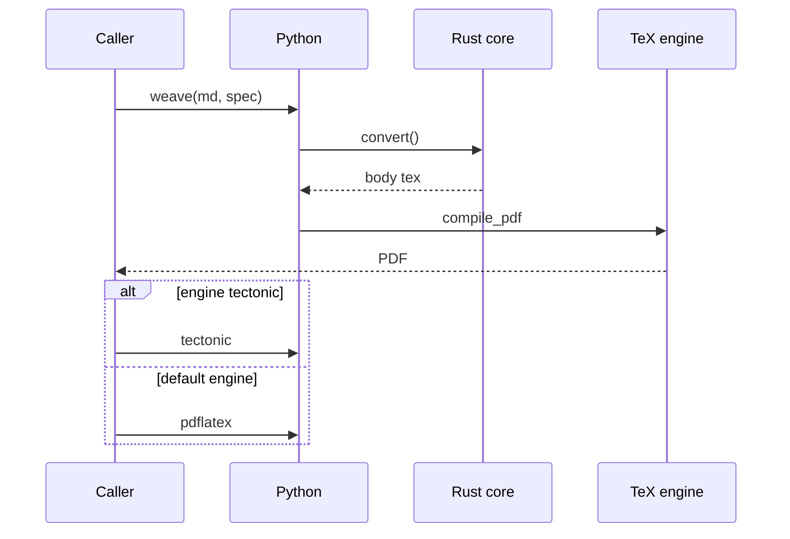

# ikat: weaving Markdown into camera-ready LaTeX

## Abstract

Manuscripts live in Markdown — camera-ready papers live in LaTeX.
ikat closes that gap with a strict-subset Markdown pipeline: a Rust
core owns parsing, layout math, and code generation while thin Python
wrappers carry strings across the boundary. Float placement, publisher
templates, and engine choice are configuration, not post-processing.
This paper is its own demo: every heading, float, table, citation,
and plot below was woven by ikat itself. (52 Rust tests, 42 Python
tests, and compile proofs guard the behavior; acceptance is one
document rebuilt to the byte.)

## 1. Introduction

The journey from draft to submission is a format translation with
opinions. Authors think in sections, figures, and `code`; publishers
think in floats, baselines, and bibliographies. Between them sits a
manual step — paste, reformat, renumber — that is tedious, brittle,
and repeated for every revision. Tools that automate it tend to fail
in one of two directions: they accept all of Markdown and produce
fragile LaTeX, or they emit beautiful LaTeX from a language nobody
writes. ikat takes the third path — a strict subset of Markdown with
**fail-fast** errors, deterministic output, and a golden master test
that keeps the published paper byte-identical across refactors.

The architecture follows one rule: Rust owns compute, Python carries
strings. Parsing, float resolution, TikZ emission, and pgfplots
generation live in the `ikat` crate; the `ikat` package exposes
`build_document`, a template library, a CLI, and an MCP server over a
single `BuildSpec` JSON boundary. Nothing crosses that boundary
except data — no callbacks, no shared state, no surprises. The whole
pipeline is $O(n)$ in document size: events in, LaTeX out, with no
tree that could blow up on a long manuscript.

Three doctrines shape every decision. First, the subset is strict:
unknown attributes, dangling citation keys, and doubled skeleton
tokens are build errors — LaTeX logs are never the debugger.
Second, defaults never move: tuning emits preamble lines only when
they differ from the LaTeX defaults, so untouched documents weave
byte-identically. Third, the paper is the test suite — §4 names the
numbers. Sections that follow use mechanisms §2–§5
describe; §6 collects the skeleton token contract.

## 2. Architecture

```mermaid {span=wide pos=top}
graph TD
md[manuscript.md<br/>strict subset + {attrs}]-->core[weave: Rust core]
toml[ikat.toml<br/>spans + floats + template]-->core
spec[BuildSpec JSON<br/>captions + keys + thanks]-->core
core-->body[woven body<br/>floats + tables + text]
tmpl[head or skeleton<br/>level 1 or level 3]-->doc[assemble document]
body-->doc
doc-->eng{engine?}
eng-->|pdflatex|pdfa[PDF via TinyTeX<br/>arXiv-closest]
eng-->|tectonic|pdfb[PDF via tectonic<br/>zero-install]
```

Figure 1 shows the build: three content inputs, a template, and one
decision. The manuscript carries content plus per-element `{attrs}`;
`ikat.toml` carries document policy — which kinds span columns,
where floats may go, which template wraps the result; the spec
carries per-build registries — diagram captions, plot captions,
table captions, citation keys. The core weaves the body, the template
wraps it, the engine compiles it. Each stage validates its own
inputs: unknown `{pos=center}` dies in Rust with the fence number,
a template that drops a needed package dies naming it, a missing
binary dies with the install command. Nothing fails in a log.

The subset boundary is deliberate. A Markdown AST library was
spiked — pulldown-cmark [the CommonMark pull parser:
`pulldown-cmark`] parses the same manuscript with identical block
structure — but our syntax (bracketed author-key citations, `{span=}` attrs,
`%%` directives) stays custom under every option, and byte-parity
with the published paper is a harder constraint than robustness
against arbitrary input. The hand scanner stays until a switch PR
proves the golden master identical. Mermaid itself is a strict
subset too: flowcharts with `-->`, `---`, edge `|labels|`, and
`[]`/`{}` nodes — anything else is a string error naming the line,
because a diagram that almost renders is worse than one that
refuses.



Figure 2 replays the same build as a sequence: the calls §2 names
— `convert()` across the PyO3 boundary, `compile_pdf` driving the
engine — with the engine choice as an `alt` box instead of prose.
Sequence diagrams dispatch on their header line through the same
`flowchart_to_tikz` entry point: participants declare columns in
order, `->>` and `-->>` messages take one row each, and
`alt`/`else`/`opt`/`end` boxes span all columns. The subset is
strict like the flowchart one — `loop`, `par`, `Note`, and
self-messages are string errors naming the statement.

## 3. Floats without fear

```mermaid {span=column pos=both width=0.9}
graph TD
el[element<br/>kind + {attrs}]-->res[resolve span + pos]
res-->col{span?}
col-->|column|f1[figure / table]
col-->|wide|f2[figure* / table*]
f1-->p1[pos: top bottom<br/>both page here<br/>force barrier]
f2-->p2[pos: top bottom<br/>both page barrier]
p1-->pkg[packages as needed<br/>float placeins<br/>dblfloatfix]
p2-->pkg
```

LaTeX float placement is where manuscripts go to drift: a figure
declared `[t]` lands three pages later and nobody knows why. ikat
treats every floatable element — diagram, picture, plot, table —
uniformly: per-element attributes resolve against document policy,
and the LaTeX rules become build errors instead of log mysteries. A
`figure*` with `here` or `force` is illegal LaTeX, so it is illegal
here too, with the fix (`span=column`) in the message. Wide floats
at the bottom load `dblfloatfix` automatically; `force` and
`barrier` load `float` and `placeins`, or require them in template
heads. Table 1 lists the attribute surface.

%% table {pos=bottom}

| Attribute | Values | Default |
|---|---|---|
| span | column or wide | per-kind `[spans]` |
| pos | top, bottom, both, page, here, force, barrier | `[floats]` default |
| width | fraction of span or TeX length | span width |
| captionpos | top or bottom | figures bottom, tables top |

Document-wide tuning lives in `[floats]`: this paper sets
`topfraction` 0.9, `bottomfraction` 0.7, `textfraction` 0.1,
`topnumber` 3, `bottomnumber` 2, and `pos_default` top — six lines
that are the only float preamble it emits, everything else LaTeX
default, so the tuning is visible and minimal. `barrier_sections`
caps the worst case by holding floats inside their section; the
engines table in §5 demonstrates the per-element `barrier`
instead, pinning itself above its own section.

## 4. Evidence

%% table {captionpos=bottom}

| Suite | What it guards | Count |
|---|---|---|
| Rust unit | emitters, scanner, templates, floats | 52 run |
| Python | pipeline, CLI, MCP, golden paper | 42 pass, 1 skip |
| Compile proofs | heads, skeleton, floats, engines | PDF-verified |

The suites in Table 2 overlap on purpose: Rust tests pin units,
Python tests pin the surface, compile proofs pin reality — a `.tex`
that never met `pdflatex` is a rumor.

† This paper is proof zero: woven, compiled, and text-verified
in one command.

### 4.1 Where the code and the tests live

Figure 4 counts lines per shipped Rust module — `doc` dominates
because assembly lives there (the test-only spike module aside) —
and Figure 5 counts test functions per commit across the build,
Rust and Python series separately. Both series are grep-true:
`#[test]` attributes and `def test` functions, counted from
history, with no smoothing and no invention. The Python steps
track texenv tests (7), the CLI/MCP surface (10), floats (12),
and skeletons (13); the Rust steps track texenv (7), templates
(8), heads (9), floats (12), skeletons (13), and the AST spike
(14). Growth is linear because each milestone ships its proofs —
the spike paper trail is typical: conjecture, probe, verdict, all in
the tree.

## 5. Engines and templates

%% table {pos=barrier}

| Question | pdflatex (default) | tectonic (optional) |
|---|---|---|
| Base engine | pdfTeX via TinyTeX | embedded XeTeX 0.17.0 |
| Install | TeX Live tree + tlmgr | zero (binary or cargo feature) |
| arXiv fidelity | closest (same engine family) | snapshot drift possible |
| BibTeX | runs when a `.bib` is staged | auto-runs always |
| Needs from ikat | nothing special | drop `inputenc`, never emit empty bibliography |

The default engine is pdfTeX because submissions are the authority:
arXiv runs TeX Live, so the closest local engine wins and the rest
is convenience. Tectonic [the self-contained TeX engine:
`tectonic-typeset`] is the zero-install path — one binary, cached
bundles, no TeX tree — and it caught two real bugs on its first
run: XeTeX dies on `[utf8]{inputenc}`, which ikat now drops
automatically, and an empty `\bibliography{}` is fatal under an
engine that auto-runs BibTeX, so the core no longer emits one.
Templates come in three levels: the generated head (level 0), nine
shipped publisher heads (level 1 — arXiv, article, IEEE [the document
class: `ieeetran-cls`], ACM, LNCS, Elsevier, APS), and whole-document skeletons (level 3, the escape
hatch this paper uses). Level 1 heads carry `{{{title}}}` tokens;
level 3 carries the contract in §6. Plotting needs no matplotlib:
bar and line emitters write pgfplots directly [the TeX plotting
package: `pgfplots-manual`], compiled standalone to the PDFs below.

## 6. Appendix: skeleton token contract

%% table {span=wide}

| Token | Fills from | Required |
|---|---|---|
| `{{title}}` `{{author}}` `{{thanks}}` | manuscript H1, spec author and thanks | as level 1, braces included |
| `{{body}}` | woven floats, tables, and text | exactly once, always |
| `{{bibliography}}` | style plus staged `.bib` name | exactly once unless `bib_name` is empty |
| `{{abstract}}` | the whole woven abstract env | exactly once when the manuscript has one |
