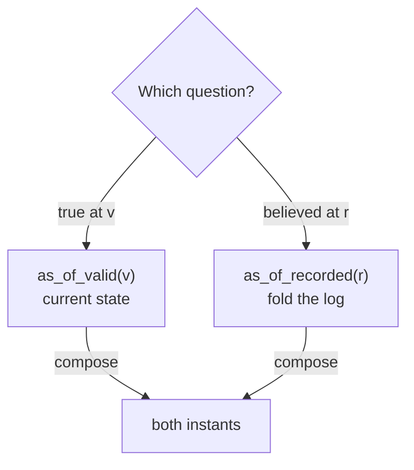

# Starter document

A diagram defaults to both columns; the `{span=column}` fence pins
this one to a single column.

```mermaid {span=column}
%% caption: Which question the read answers.
%% label: fig:which-question
graph TD
q{"Which question?"}
q -->|"true at v"| av["as_of_valid(v)<br/>current state"]
q -->|"believed at r"| ar["as_of_recorded(r)<br/>fold the log"]
av -->|compose| both["both instants"]
ar -->|compose| both
```
