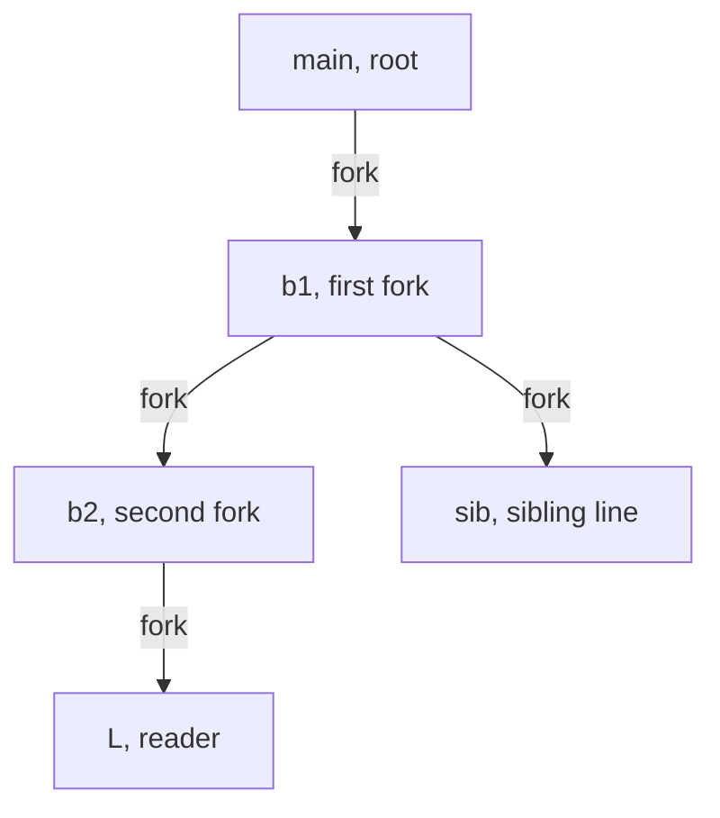

```mermaid
graph TD
main["main, root"]
b1["b1, first fork"]
b2["b2, second fork"]
sib["sib, sibling line"]
L["L, reader"]
main -->|"fork"| b1
b1 -->|"fork"| b2
b1 -->|"fork"| sib
b2 -->|"fork"| L
```
