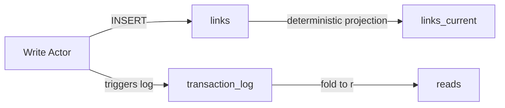

```mermaid
graph LR
actor["Write Actor"]
links["links"]
tlog["transaction_log"]
cur["links_current"]
reads["reads"]
actor -->|"INSERT"| links
actor -->|"triggers log"| tlog
links -->|"deterministic projection"| cur
tlog -->|"fold to r"| reads
```
