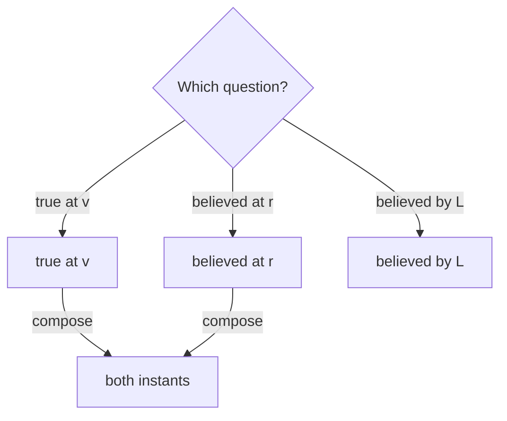

```mermaid
graph TD
q{"Which question?"}
av["true at v"]
ar["believed at r"]
rc["believed by L"]
both["both instants"]
q -->|"true at v"| av
q -->|"believed at r"| ar
q -->|"believed by L"| rc
av -->|"compose"| both
ar -->|"compose"| both
```
