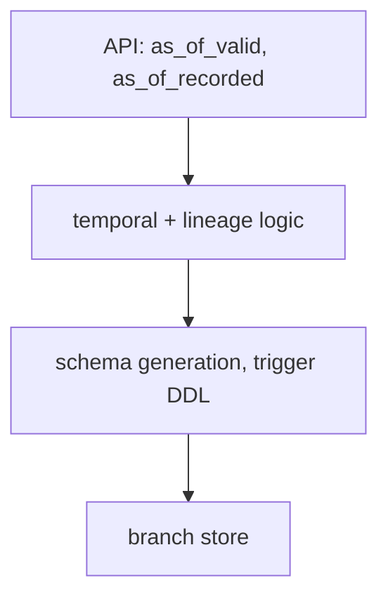

```mermaid
graph TD
api["API: as_of_valid, as_of_recorded"]
logic["temporal + lineage logic"]
ddl["schema generation, trigger DDL"]
store["branch store"]
api --> logic
logic --> ddl
ddl --> store
```
